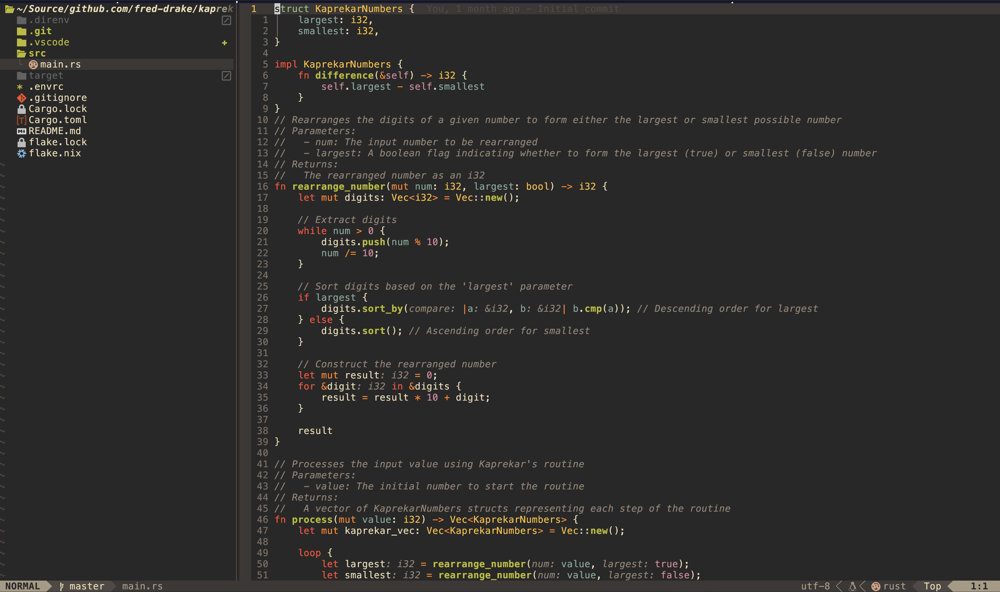

# ❄️ My Personal Neovim Setup ❄️

My Nix-based Neovim configuration. For when you have an unhealthy obsession for declarativity and configurability.



## Usage

Option 1: Clone and run

```bash
git clone https://github.com/fred-drake/neovim.git
nix run .#
```

Option 2: Run directly

```bash
nix run github:fred-drake/neovim#
```

### Configurations

The default configuration performs editing without settings for any particular language or technology. The following configurations allow for CMP, LSP, Tree-Sitter and DAP in their respective language or technology stack:

- Rust `nix run github:fred-drake/neovim#rust`
- C# `nix run github:fred-drake/neovim#csharp`
- Go `nix run github:fred-drake/neovim#golang`
- Python `nix run github:fred-drake/neovim#python`
- Javascript `nix run github:fred-drake/neovim#javascript`

### Install Multiple Configurations

You can have multiple neovim configurations (`nvim`, `nvim-rust`, `nvim-golang`, etc). Take a look at my [system configuration flake](https://github.com/fred-drake/nix/blob/main/flake.nix) to see how I do this, but here's the gist:

Create a function that creates neovim links with unique configuration names:

```nix
    mkNeovimPackages = pkgs: neovimPkgs: let
      mkNeovimAlias = name: pkg:
        pkgs.runCommand "neovim-${name}" {} ''
          mkdir -p $out/bin
          ln -s ${pkg}/bin/nvim $out/bin/nvim-${name}
        '';
```

And add it to your home-manager imports:

```nix
    ({pkgs, ...}: {
      home.packages =
        (builtins.attrValues (mkNeovimPackages pkgs inputs.neovim.packages.${pkgs.system}))
        ++ [inputs.neovim.packages.${pkgs.system}.default];
    })
```

## Technology Support

| Technology | Formatter    | Language Server                    | Debugger        | Nix Configuration |
| ---------- | ------------ | ---------------------------------- | --------------- | ----------------- |
| Nix        | alejandra    | nil-ls, nixd                       |                 | default           |
| Just       | just         |                                    |                 | default           |
| SQL        | sqlformat    |                                    |                 | default           |
| Lua        | stylua       |                                    |                 | default           |
| YAML       | yamlfmt      | yamllint, yamlls                   |                 | default           |
| CSS        | prettier     |                                    |                 | default           |
| HTML       | prettier     |                                    |                 | default           |
| Javascript | prettier     |                                    |                 | default           |
| Typescript | prettier     |                                    |                 | default           |
| JSON       | prettier     | jsonls                             |                 | default           |
| Markdown   | prettier     | marksman                           |                 | default           |
| Ruby       | rubyfmt      |                                    |                 | default           |
| Terraform  | tofu_fmt     |                                    |                 | default           |
| TOML       | taplo        | taplo                              |                 | default           |
| C#         | csharpier    | csharp-ls                          | netcoredbg      | csharp            |
| Go         | golines      | gopls                              | delve           | golang            |
| Python     | black, isort | flake8, jedi, pylint, rope, mccabe | dap-python      | python            |
| Rust       | rustfmt      | clippy                             | lldb            | rust              |
| Node       | prettier     | tsserver                           | vscode-js-debug | javascript        |
